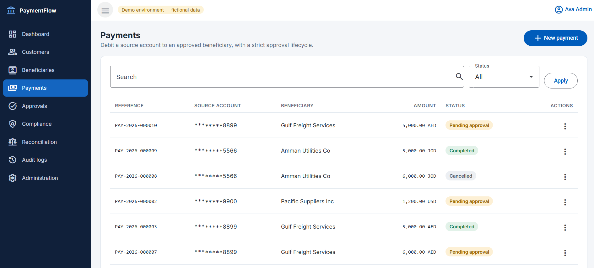
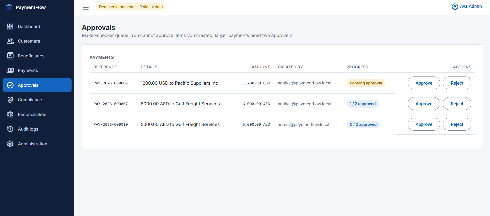
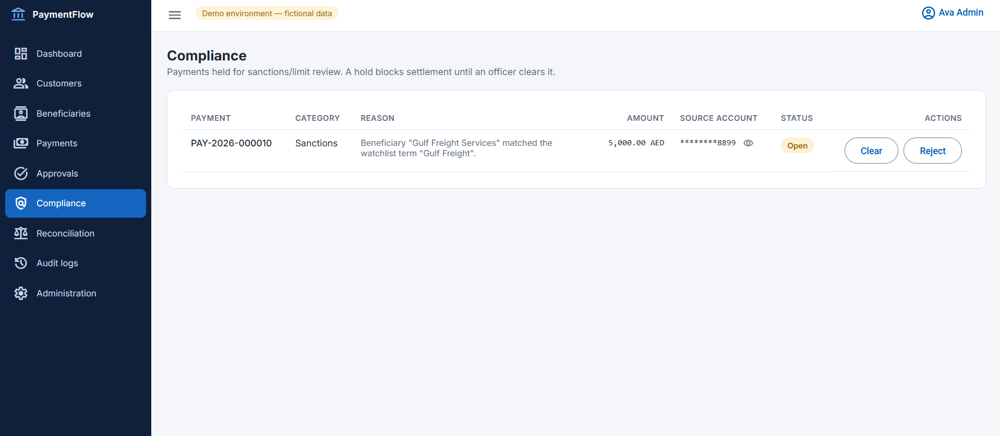
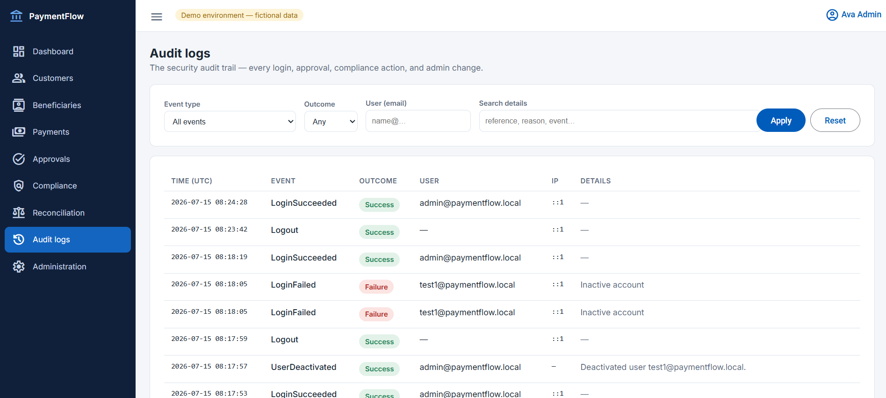
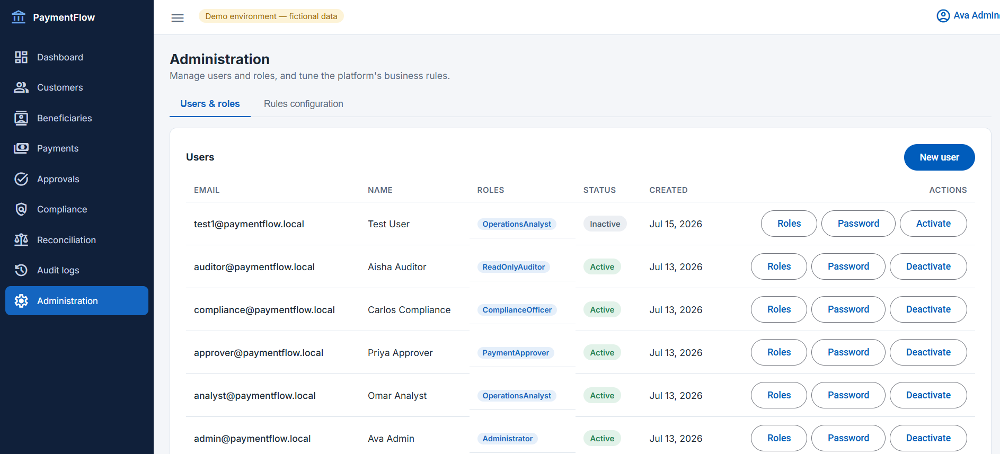
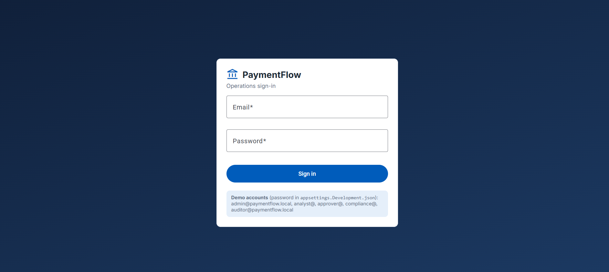
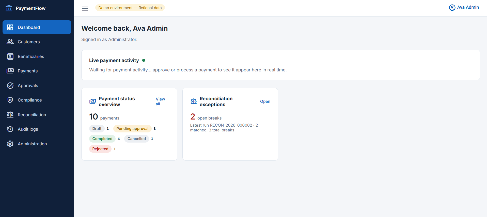
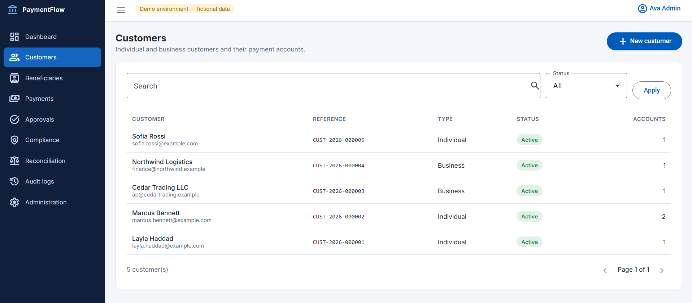
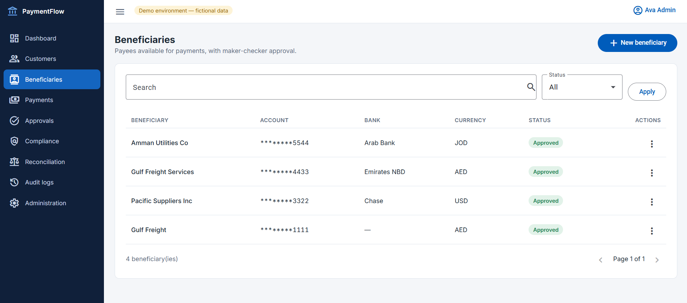
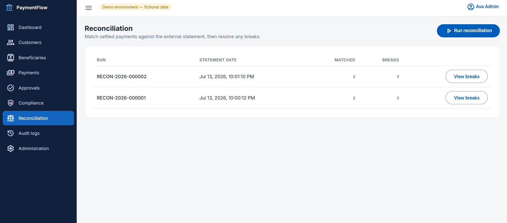

# PaymentFlow

An internal **banking operations platform** — payments captured, screened, approved under maker–checker, settled, reconciled against a bank statement, and audited end to end.

Built as a portfolio project to demonstrate production-shaped .NET and Angular: Clean Architecture, CQRS, role-based authorization, optimistic concurrency, idempotency, and a full audit trail — on a domain where those patterns actually matter.

> **Fictional demo.** Every customer, account, and payment is synthetic. Settlement and the "bank statement" are simulated behind interfaces. Not a real banking system and not hardened for production — see [Deliberate trade-offs](#deliberate-trade-offs).

---

## Contents

- [What it does](#what-it-does)
- [Screenshots](#screenshots)
- [Tech stack](#tech-stack)
- [Architecture](#architecture)
- [Engineering highlights](#engineering-highlights)
- [Running it locally](#running-it-locally)
- [Demo users](#demo-users)
- [Tests](#tests)
- [Project structure](#project-structure)
- [Design docs](#design-docs)
- [Deliberate trade-offs](#deliberate-trade-offs)

---

## What it does

A payment moves through a realistic operational lifecycle, and each stage is enforced server-side:

```
Draft → [screening] → PendingApproval → Approved → Processing → Completed
                           │                                   └→ Failed
                           └→ Rejected / Cancelled
```

- **Customers, accounts & beneficiaries** — with masked account numbers and a role-gated, audited "reveal" of the full number.
- **Payments** — created with an idempotency key so a retried request returns the original payment instead of a duplicate.
- **Compliance screening** — automatic watchlist/limit checks on submit raise a *hold* that blocks settlement until a Compliance Officer clears it.
- **Maker–checker approvals** — amount bands decide whether a payment auto-approves, needs one approver, or needs two distinct approvers. A maker can never approve their own payment.
- **Simulated settlement** — a background worker drains approved payments through the same routine the manual endpoint uses, pushing live status over SignalR.
- **Reconciliation** — matches settled payments against a simulated external statement and classifies the differences (missing from statement, missing from ledger, amount mismatch), each resolvable with notes.
- **Audit logs** — a filterable, read-only trail of every login, approval, compliance decision, and admin change.
- **Administration** — user & role management, plus runtime-editable business rules (approval bands, screening watchlists, reconciliation drift, settlement behaviour) with no redeploy.

## Screenshots

**Payments** — the operational worklist, with status, amounts, and role-gated actions.



**Approvals** — the checker's queue. A maker never sees their own payment here.



**Compliance** — holds raised by automatic screening, cleared or rejected with notes.



**Audit logs** — every login, approval, compliance decision, and admin change, filterable.



**Administration** — user & role management plus runtime-editable business rules.



<details>
<summary><b>More screens</b> — login, dashboard, customers, beneficiaries, reconciliation</summary>

<br>

**Login** — five demo roles, each landing in a different version of the app.



**Dashboard** — payment counts by status at a glance.



**Customers** — customers and their accounts, with masked account numbers.



**Beneficiaries** — payees, themselves subject to an approval flow before use.



**Reconciliation** — ledger vs. statement, with each break classified and resolvable.



</details>

## Tech stack

**Backend** — .NET 10 · ASP.NET Core · EF Core 10 (SQL Server) · MediatR · FluentValidation · ASP.NET Identity + JWT · SignalR · Serilog · Swagger · xUnit

**Frontend** — Angular 20 (standalone components, signals) · Angular Material · RxJS · TypeScript

## Architecture

Clean Architecture with a strictly inward dependency rule — **Domain** knows nothing about anything else, and **Infrastructure** is replaceable without touching business logic:

```
┌─────────────────────────────────────────────────────┐
│  Api            controllers · policies · middleware  │
├─────────────────────────────────────────────────────┤
│  Infrastructure EF Core · Identity · settlement      │
│                 screening · statement feed           │
├─────────────────────────────────────────────────────┤
│  Application    CQRS handlers · validators · DTOs    │
│                 abstractions (ports)                 │
├─────────────────────────────────────────────────────┤
│  Domain         entities · transitions · invariants  │
└─────────────────────────────────────────────────────┘
        dependencies point inward ↑
```

**Domain owns its transitions.** Entities expose explicit methods (`payment.Approve(...)`, `complianceCase.Clear(...)`) that throw on an invalid change — state is never mutated by setters from the outside. The Application layer translates that into a `409 Conflict`.

**Every simulated seam sits behind an interface** — `ISettlementSimulator`, `IComplianceScreeningService`, `IExternalStatementProvider`, `IApprovalPolicyProvider`. Swapping the demo implementation for a real bank integration means writing one class, not editing the engines.

## Engineering highlights

**Result pattern, not exceptions for control flow.** Expected business failures are values (`Result<T>` + a typed `Error`), so callers must handle them. One mapping layer turns each error type into the right HTTP status — `Validation → 400`, `Forbidden → 403`, `NotFound → 404`, `Conflict → 409`. Exceptions stay reserved for genuinely exceptional situations.

**Optimistic concurrency throughout.** Mutable records carry a `RowVersion`; clients round-trip it and a concurrent edit surfaces as a `409` rather than a silent last-write-wins.

**Named authorization policies.** Controllers declare intent (`CanApprovePayments`, `CanReadAuditLog`) instead of scattering role lists across attributes. Five roles: Administrator, Operations Analyst, Payment Approver, Compliance Officer, Read-Only Auditor.

**Idempotent payment creation.** An `Idempotency-Key` header makes retries safe — a network timeout can't create a duplicate payment.

**Runtime-editable rules with config fallback.** Business rules live in an admin-editable store, resolved as *stored override → `appsettings` default*. The engines were never modified to support this — only how their providers fetch options changed, which is the payoff of having put those seams behind interfaces in the first place.

**Audit as a first-class trail.** Administration is itself audited: changing a rule or a user's roles writes an event that shows up in the audit viewer alongside logins and approvals.

**Cross-cutting concerns as pipeline behaviours.** Validation and logging wrap every command via MediatR behaviours, so no handler repeats them.

## Running it locally

**Prerequisites:** .NET 10 SDK · Node.js 22+ · Docker (or a local SQL Server)

Dev-only credentials are committed in `appsettings.Development.json`, so there's nothing to configure for a local run.

**1. Start SQL Server**

```bash
docker compose up -d sqlserver
```

**2. Create the database and run the API**

```bash
dotnet ef database update --project src/PaymentFlow.Infrastructure --startup-project src/PaymentFlow.Api
dotnet run --project src/PaymentFlow.Api
```

API on **http://localhost:5080** · Swagger at **/swagger** · health at **/health**. Roles, demo users, and demo data seed automatically on first start.

**3. Run the frontend**

```bash
cd frontend/paymentflow-web
npm install
npm start
```

App on **http://localhost:4200**.

> Prefer containers? `docker compose up` runs the API and SQL Server together — set `JWT_SECRET` in a `.env` first (see `.env.example`).

## Demo users

All share the password `Demo!Passw0rd1`.

| Email | Role | Can |
|---|---|---|
| `admin@paymentflow.local` | Administrator | Everything, including administration |
| `analyst@paymentflow.local` | Operations Analyst | Create customers, beneficiaries, payments |
| `approver@paymentflow.local` | Payment Approver | Approve/reject payments and beneficiaries |
| `compliance@paymentflow.local` | Compliance Officer | Clear/reject holds, reveal account numbers |
| `auditor@paymentflow.local` | Read-Only Auditor | Read-only, plus the audit log |

Sign in as different users to see the UI and API surface change — the sidebar, row actions, and endpoints are all role-gated.

**Things worth trying:** submit a payment to *"Gulf Freight Services"* (watchlisted → compliance hold). Submit one for 5,000+ (needs two approvers). Approve one ending in `.13` (deterministic settlement failure). Run reconciliation (produces one break of each type). Then check the audit log — all of it is there.

## Tests

```bash
dotnet test
```

Three levels, matching the architecture:

- **Domain** — pure transition and invariant tests, no infrastructure.
- **Application** — validators and business rules in isolation.
- **Integration** — the real API pipeline (auth, policies, middleware) against SQLite in-memory, so no SQL Server is needed. Covers the paths that matter: a maker can't approve their own payment, a deactivated user can't log in, a stale `RowVersion` yields 409, a non-admin gets 403.

## Project structure

```
src/
  PaymentFlow.Domain/          entities, transitions, invariants
  PaymentFlow.Application/     CQRS handlers, validators, abstractions
  PaymentFlow.Infrastructure/  EF Core, Identity, simulated seams
  PaymentFlow.Api/             controllers, policies, middleware
tests/
  PaymentFlow.Domain.Tests/
  PaymentFlow.Application.Tests/
  PaymentFlow.Api.IntegrationTests/
frontend/paymentflow-web/      Angular 20 SPA
docs/                          design doc per phase
```

## Design docs

Built in seven phases, each with a design doc written before the code:

| Phase | Doc |
|---|---|
| 01 | [Foundation & authentication](docs/PHASE-01-foundation-and-authentication.md) |
| 02 | [Customers, accounts & beneficiaries](docs/PHASE-02-customers-accounts-beneficiaries.md) |
| 03 | [Payments lifecycle & idempotency](docs/PHASE-03-payments-lifecycle-idempotency.md) |
| 04 | [Maker–checker approval engine](docs/PHASE-04-maker-checker-approval-engine.md) |
| 05 | [Simulated payment processing](docs/PHASE-05-simulated-payment-processing.md) |
| 06 | [Compliance & reconciliation](docs/PHASE-06-compliance-and-reconciliation.md) |
| 07 | [Audit logs & administration](docs/PHASE-07-audit-logs-and-administration.md) |

## Deliberate trade-offs

Known and intentional, kept honest rather than hidden:

- **Tokens in `localStorage`.** Convenient for a demo; a production pass would move the refresh token to an `httpOnly` cookie.
- **No FX.** Amounts are compared in their own currency; approval bands don't convert.
- **Settlement is simulated** by a deterministic rule (cents `== 13` fails) so demos are reproducible. Real integration drops in behind `ISettlementSimulator`.
- **Worker options are read at startup.** Changing processing cadence or the auto-process toggle in Administration takes effect on the next API restart; the failure sentinel applies immediately.
- **Rules are read per-call** with no cache — negligible at demo scale, an easy optimization later.
- **References are count-based** (`PAY-2026-000001`), which would need a sequence under real concurrent volume.
